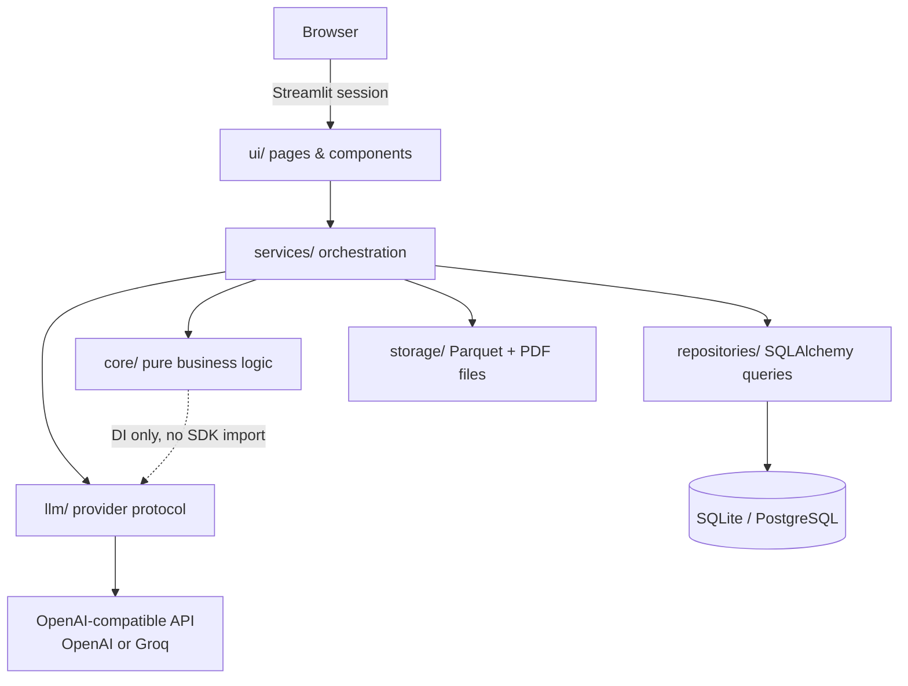
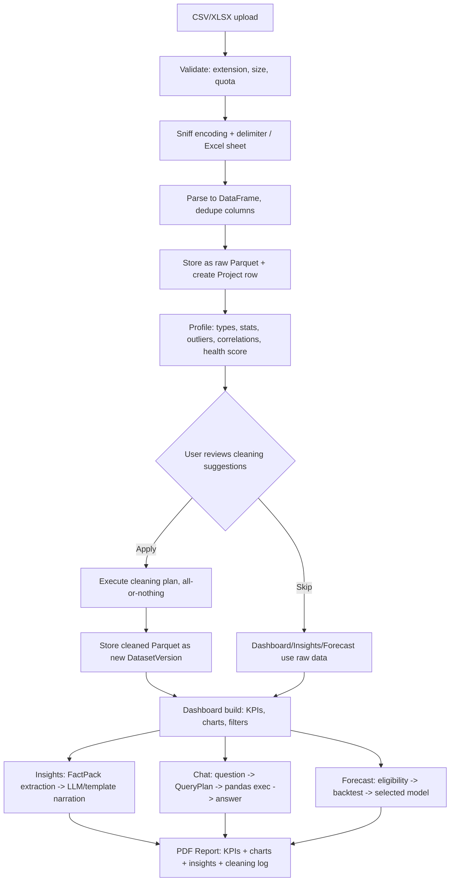
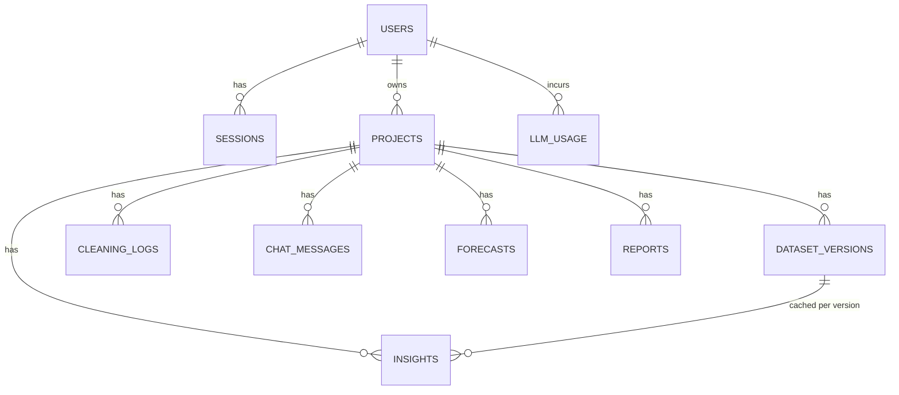
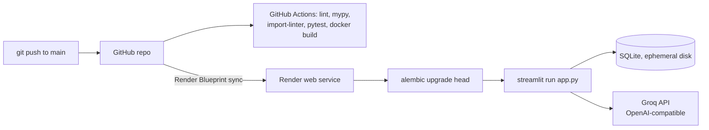

# DataVerse AI

An AI-powered Business Intelligence platform: upload a CSV or Excel file and get automated data cleaning, interactive dashboards, grounded AI insights, backtested forecasts, a natural-language chat interface, and exportable PDF reports — without writing SQL or Python.

---

## Overview

**What it does.** A user uploads a spreadsheet. The system parses it, profiles data quality (missing values, duplicates, wrong types, outliers), lets the user review and apply cleaning fixes, then automatically builds an interactive dashboard, writes an executive summary, answers natural-language questions about the data, forecasts numeric trends, and exports a PDF report.

**Why it exists.** Most people with a spreadsheet full of business data cannot write a `GROUP BY`, fit a forecasting model, or spot that a "revenue" column is 12% text-formatted currency strings. This project automates the analyst's job end-to-end, with one architectural rule enforced throughout: **the AI never computes a number.** Every figure shown to the user — in dashboards, insights, or chat answers — is computed by deterministic pandas/statsmodels/scikit-learn code. The LLM is only ever used to (a) write prose around numbers it was handed, or (b) translate a question into a constrained, validated query plan that a whitelisted interpreter executes. This eliminates hallucinated numbers and makes the AI safe to expose to arbitrary user questions.

**Who it's for.** Non-technical business users (the in-app persona), and — as a build artifact — a reference implementation of a layered, tested, CI-gated Streamlit application for engineers evaluating the codebase.

---

## Key Features

Only features with working code behind them are listed.

### Data
- CSV/XLSX/XLS upload with encoding detection (`charset-normalizer`) and delimiter sniffing
- Multi-sheet Excel support (sheet picker)
- Duplicate/blank column name repair
- Automated data profiling: semantic type inference (detects currency strings, text-formatted dates, and booleans stored as text, plus ID-column detection), missing values, duplicate rows, numeric stats, outliers (IQR, z-score, IsolationForest), Pearson/Spearman correlations
- Composite 0–100 **Data Health Score** with per-issue penalties (capped per issue family)
- Reviewable, rule-based cleaning: deduplicate, type coercion, missing-value imputation (median/mean/zero/mode/label/drop, selectable per column), outlier handling (keep/cap/remove — defaults to **keep**), constant-column drop
- Before/after comparison and an immutable per-project cleaning log
- Raw upload is never mutated; cleaning produces a separate "cleaned" dataset version

### Analytics
- Auto-generated dashboard: KPI cards with period-over-period deltas, time-series line charts (day/week/month resampling chosen by date span), top-N category bar charts, category-share donuts, distribution histograms, box plots by segment, correlation heatmap
- Date-range and category filters that re-run the dashboard build
- Cleaned-CSV download

### AI
- Executive summary + trend/segment/anomaly/recommendation insight cards, generated from a deterministically computed `FactPack` (totals, growth %, best/worst period, segment shares, outlier counts) — the LLM only rephrases these facts
- Rule-based **template fallback** for insights when no LLM key is configured (the app never hard-fails here)
- Natural-language chat: question → LLM-generated JSON `QueryPlan` (7 whitelisted operations) → Pydantic-validated → executed by a hand-written pandas interpreter (no `eval`, no generated code execution) → LLM composes the final sentence from the computed result
- Chat answers show the executed query plan for audit ("View query")
- Multi-provider LLM support: any OpenAI-compatible endpoint via one config value (`LLM_BASE_URL`) — used in production to run on Groq instead of OpenAI
- Per-project LLM spend cap (`LLM_BUDGET_USD_PER_PROJECT`, default $0.25) backed by a token-usage ledger table

### Forecasting
- Eligibility gate (needs a date column + numeric metric + ≥12 aggregated periods) with a human-readable reason when not eligible
- Two competing models — seasonal-naive baseline and damped-trend Holt-Winters — selected by holdout MAPE (the fancier model must win to be used)
- 80%/95% confidence bands derived from backtest residual standard deviation, widening with `sqrt(horizon)`
- AI narrative over the forecast, with a template fallback

### Reports
- PDF export (ReportLab): cover page, executive summary, KPI table, chart images, insight cards, full cleaning audit appendix
- Chart images for PDFs are rendered with **matplotlib**, not the interactive Plotly renderer (see [Design Decisions](#design-decisions))
- Report history per project, re-downloadable

### Platform
- Email/password registration and login, bcrypt password hashing, signed (itsdangerous) server-side session tokens
- Account lockout after 5 failed logins (15-minute lockout), timing-uniform failure responses (no user enumeration)
- Per-user project ownership enforced at the repository query level; unauthorized access returns the same "not found" as a nonexistent resource
- Per-user storage quota (default 500 MB)

---

## Tech Stack

| Layer | Technology | Purpose | Reason for choosing it |
|---|---|---|---|
| UI | Streamlit ≥1.36 | Server-rendered single-process web app | Fastest path to a working data app for a solo build; native Plotly/pandas integration |
| Data | Pandas ≥2.2 (`[performance]`), NumPy, PyArrow | Dataframe ops, Parquet I/O | Standard Python data-processing stack |
| Storage format | Apache Parquet | Columnar storage for raw/cleaned dataset versions | Compressed, columnar, avoids storing millions of rows relationally |
| Charts (interactive) | Plotly ≥5.22 | In-app dashboard charts | Interactive, pandas-native |
| Charts (static) | Matplotlib ≥3.8 (Agg backend) | PDF report chart images | Kaleido (Plotly's static-export engine) hung intermittently on the dev host; matplotlib is pure Python, deterministic |
| ML / stats | scikit-learn ≥1.5 (IsolationForest), statsmodels ≥0.14 (Holt-Winters) | Outlier detection, forecasting | Neither is available in pandas alone |
| Database ORM | SQLAlchemy ≥2.0 + Alembic | Metadata persistence, schema migrations | Typed ORM with a mature migration tool |
| Database engine | SQLite (dev / current live deploy) or PostgreSQL (`psycopg2-binary`) | Metadata storage (not dataset rows) | SQLite = zero-setup dev; Postgres = the documented production target |
| Auth | passlib + bcrypt, itsdangerous | Password hashing, signed session tokens | ~200 lines of custom code vs. a heavier third-party auth framework with weaker session semantics |
| Validation / config | Pydantic ≥2.7, pydantic-settings | DTOs, typed env-var configuration | Runtime-validated boundaries between layers |
| LLM client | `openai` Python SDK ≥1.35 | Talks to OpenAI **or any OpenAI-compatible API** | One SDK, pointed at a different `base_url` — no per-provider adapter needed |
| PDF | ReportLab ≥4.2 | Report document assembly | Pure Python; WeasyPrint's native GTK dependency is painful on Windows/containers |
| Logging | structlog ≥24.1 | Structured JSON/console logs | Context-bound logging (request/user/project IDs on every line) |
| Testing | pytest, pytest-cov, hypothesis | Unit/integration/property-based tests | Hypothesis used for one imputation invariant test |
| Lint/type | ruff, mypy (strict-ish) | Style + static typing | Fast, single-tool linting; mypy catches boundary type errors |
| Architecture enforcement | import-linter | Enforces the layer dependency direction in CI | Prevents architecture erosion over time |
| Containerization | Docker, docker-compose | Reproducible runtime; local Postgres for dev | Single image works locally and on hosting platforms |
| CI | GitHub Actions | Lint → type-check → layer-check → test → Docker build → secret scan | Standard, free for public repos |
| Deployment | Render (Blueprint / `render.yaml`) | Hosts the live deployment | Free tier, git-driven deploys |

---

## Architecture Overview

DataVerse AI is a **layered monolith**, not a microservice system and not a client/server split — there is no separate frontend or backend process; Streamlit renders server-side and calls Python service functions in the same process. The layering is enforced in CI by `import-linter`, defined in `pyproject.toml`:

```
ui  →  services  →  (core | repositories | storage | llm)  →  schemas / models  →  utils  →  config
```

- **`ui/`** — Streamlit pages and components. Only layer allowed to import `streamlit`.
- **`services/`** — orchestrates one user-facing operation (e.g. "ingest a file", "apply a cleaning plan") by combining `core` logic with `repositories`, `storage`, and `llm`. Only layer allowed to open a DB session.
- **`core/`** — pure business logic (profiling, cleaning rules, dashboard building, forecasting, insight/chat logic). Provably has **no** dependency on Streamlit, SQLAlchemy, or the `openai` SDK — enforced by a second import-linter contract. The one intentional exception: `core.chat`/`core.insights` depend on `llm.provider` (a `Protocol`, not a concrete SDK) via dependency injection.
- **`repositories/`** — SQLAlchemy queries only, one class per aggregate (`UserRepository`, `ProjectRepository`).
- **`storage/`** — a `StorageBackend` protocol; only a `local` (filesystem) implementation exists today (see [Limitations](#limitations)).
- **`llm/`** — an `LLMProvider` protocol with two implementations: `OpenAIProvider` (works against OpenAI or any OpenAI-compatible endpoint) and `NullProvider` (degraded mode, always raises `LLMUnavailableError`).
- **`schemas/` / `models/`** — Pydantic DTOs and SQLAlchemy ORM models, respectively. Datasets themselves are never modeled as ORM rows; only their Parquet storage keys and profiling JSON are.



---

## Folder Structure

```
DATAVERSE-AI/
├── app.py                    Streamlit entrypoint: page config, logging init, routing
├── pyproject.toml            Dependencies, ruff/mypy/pytest/import-linter config
├── Dockerfile                Single-stage image; runs migrations then Streamlit
├── docker-compose.yml        app + Postgres for local Docker use
├── render.yaml               Render Blueprint for the live deployment (SQLite-based, see Deployment)
├── alembic.ini / migrations/ 5 migration revisions, one per schema addition
├── scripts/seed.py           Idempotent demo user + fully-processed sample project
├── sample_data/              Bundled demo CSV (2,669 rows, deliberately messy)
├── .github/workflows/ci.yml  Lint, type-check, layer-check, test, Docker build, secret scan
├── ARCHITECTURE.md           Full design document (requirements, schema, roadmap, trade-offs)
│
├── src/dataverse/
│   ├── config/                Settings (pydantic-settings) + constants
│   ├── models/                SQLAlchemy ORM models (10 tables)
│   ├── schemas/                Pydantic DTOs crossing layer boundaries
│   ├── repositories/           SQLAlchemy query layer (user, project) + DB session/engine setup
│   ├── storage/                StorageBackend protocol + local filesystem implementation
│   ├── llm/                    LLMProvider protocol, OpenAI-compatible adapter, null provider, pricing table
│   ├── core/
│   │   ├── profiling/          Type inference, outlier detection, correlations, health score
│   │   ├── cleaning/           Cleaning rules (pure functions), suggester, executor
│   │   ├── dashboard/          Column-role ranking, chart-spec builder, Plotly figures, matplotlib report images
│   │   ├── forecasting/        Eligibility check, series prep, models, backtest-based selector
│   │   ├── insights/           Deterministic fact extraction + narration (LLM or template)
│   │   └── chat/                QueryPlan DSL: planner (LLM), executor (pandas), composer (LLM)
│   ├── services/                One module per user-facing workflow (auth, ingestion, pipeline, dashboard,
│   │                            insight, chat, forecast, report, llm_budget)
│   └── ui/
│       ├── theme.py, state.py, guards.py, router.py, errors.py
│       ├── components/          Reusable chart renderers, cleaning-review panel, empty states
│       └── pages_impl/          One module per page (auth, projects, upload, data_health, dashboard,
│                                 insights, chat, forecast, reports)
│
└── tests/
    ├── unit/                    23 test files, most of the suite
    ├── integration/              Streamlit `AppTest`-driven UI flow tests
    └── fixtures/torture.py       20+ deliberately malformed CSV/Excel generators
```

---

## Module Breakdown

| Module | Purpose | Key entry points | Depends on | Produces |
|---|---|---|---|---|
| `core/profiling` | Understand a raw dataframe | `profile_dataframe()` | pandas, scikit-learn | `DatasetProfile` (per-column stats, health score) |
| `core/cleaning` | Suggest and apply fixes | `suggest_cleaning()`, `execute_plan()` | `core/profiling` types | Cleaned dataframe + `CleaningLogEntry` list |
| `core/dashboard` | Turn a dataframe + profile into a chart spec | `build_dashboard()`, `figures.build_figure()`, `report_images.render_png()` | pandas, numpy | `DashboardSpec` (JSON-serializable), Plotly/matplotlib figures |
| `core/forecasting` | Fit and select a time-series model | `check_eligibility()`, `run_forecast()` | statsmodels | `ForecastResult` with history + confidence bands |
| `core/insights` | Deterministic facts → AI/template prose | `extract_facts()`, `narrate()` | `LLMProvider` (DI) | `InsightSet` |
| `core/chat` | NL question → validated answer | `plan_query()`, `execute_query_plan()`, `compose_answer()` | `LLMProvider` (DI) | `ChatAnswer` with plan + chart audit trail |
| `services/ingestion_service` | Validate/parse an upload, persist raw Parquet | `parse_upload()`, `create_project_from_upload()` | `core/profiling` (indirect via pipeline), storage, repositories | New `Project` + raw `DatasetVersion` |
| `services/pipeline_service` | Profile / clean / export orchestration | `profile_project()`, `apply_cleaning()`, `export_csv()` | `core/profiling`, `core/cleaning`, storage | Persisted profile JSON, cleaned `DatasetVersion` |
| `services/dashboard_service` | Pick raw vs. cleaned data, build the dashboard | `build()` | `core/dashboard`, `pipeline_service` | `DashboardSpec` |
| `services/insight_service` | Cache-aware insight generation + budget check | `generate()` | `core/insights`, `llm_budget` | Persisted `Insight` rows |
| `services/chat_service` | Full ask→answer→persist flow | `ask()`, `history()` | `core/chat`, `llm_budget` | Persisted `ChatMessage` rows |
| `services/forecast_service` | Eligibility + run + narrative + persistence | `eligibility()`, `run()` | `core/forecasting`, `llm` | Persisted `Forecast` row |
| `services/report_service` | Assemble and store the PDF | `generate_pdf()`, `list_reports()` | ReportLab, `dashboard_service`, `insight_service` | Persisted `Report` row + PDF bytes |
| `services/llm_budget` | Enforce/record per-project LLM spend | `check_budget()`, `record_usage()` | `pricing.py` | `LLMUsageRecord` rows |
| `services/auth_service` | Register/login/logout/session resolution | `register()`, `login()`, `current_user()` | `security.py`, repositories | `AuthResult` / `UserDTO` |
| `services/project_service` | CRUD over projects (ownership-scoped) | `list_projects()`, `delete_project()` | repositories, storage | `ProjectSummary` |

---

## Data Flow



Step-by-step: **Upload → Validate → Parse → Store raw → Profile → (optional) Clean → Store cleaned → Dashboard/Insights/Chat/Forecast → PDF Report.** Every stage after "Store raw" can be re-run from the immutable raw Parquet file; nothing overwrites it.

---

## Database

10 tables, all owned by SQLAlchemy models in `src/dataverse/models/`. Datasets themselves are **not** stored here — only metadata and Parquet/PDF storage keys (see [Design Decisions](#design-decisions)).

| Table | Purpose | Key columns / FKs |
|---|---|---|
| `users` | Accounts | `email` (unique), `password_hash`, `failed_logins`, `locked_until` |
| `sessions` | Server-side session tokens | `user_id` → `users.id` (CASCADE), `expires_at`, `revoked` |
| `projects` | One uploaded dataset per project | `user_id` → `users.id` (CASCADE), `status`, `health_score`, `deleted_at` (soft delete) |
| `dataset_versions` | Raw and cleaned Parquet pointers | `project_id` → `projects.id`, unique on `(project_id, kind)`, `profile_json` |
| `cleaning_logs` | Immutable audit trail of applied cleaning rules | `project_id` → `projects.id`, `rule_name`, `params_json`, `rows_affected` |
| `insights` | Generated insight cards, cached per dataset version | `project_id`, `dataset_version_id` → `dataset_versions.id` (both CASCADE) |
| `chat_messages` | Conversation history with audit trail | `project_id` → `projects.id`, `query_plan_json`, `chart_spec_json` |
| `forecasts` | Persisted forecast runs | `project_id` → `projects.id`, `backtest_mape`, `result_json` |
| `reports` | Generated PDF metadata | `project_id` → `projects.id`, `storage_key`, `size_bytes` |
| `llm_usage` | Per-call token/cost ledger | `user_id` → `users.id`, `project_id` → `projects.id` (SET NULL), `cost_usd` |

All primary keys are UUID strings (non-guessable, avoids sequential-ID enumeration). All tables have `created_at`/`updated_at` via a shared `TimestampMixin`.



Migrations are managed with Alembic (`migrations/versions/`, 5 revisions — baseline, users/projects, cleaning_logs, insights/chat/llm_usage, forecasts/reports).

---

## API Documentation

**Not evident from the repository: there is no REST, GraphQL, or other HTTP API.** This is a server-rendered Streamlit monolith — UI page modules in `ui/pages_impl/` call Python functions in `services/` directly, in the same process. There is no client/server network boundary inside the application.

The closest analog is the **service-layer contract** — every `services/*.py` function is written with a stable, typed signature (`user_id`, `project_id`, ...) → typed DTO, by design so it could be mounted onto a future FastAPI layer without changing `core/`. The full method list is in the [Module Breakdown](#module-breakdown) table above.

---

## AI Components

| | |
|---|---|
| **Model** | Configurable via `LLM_MODEL` + `LLM_BASE_URL`. Default: `gpt-4o-mini` against OpenAI. The live deployment runs `llama-3.3-70b-versatile` against Groq's OpenAI-compatible endpoint. |
| **Client** | `openai` Python SDK, instantiated once per request with `base_url` optionally overridden — the same code path serves any OpenAI-compatible provider (`src/dataverse/llm/openai_provider.py`). |

**Insights prompt flow** (`core/insights/narrator.py`):
1. `extract_facts()` computes a `FactPack` — totals, mean, half-over-half growth %, best/worst period, top/bottom segment shares, outlier counts — **all in pandas, zero LLM involvement**.
2. The FactPack is serialized to JSON and sent to the LLM with a system prompt instructing it to cite the given numbers verbatim and never invent one.
3. Output is parsed as `{"items": [{"kind", "title", "content"}, ...]}`; on any parse failure, or when no LLM is configured, a fully deterministic template renderer (`_narrate_template()`) produces the same shape of output from the same FactPack.

**Chat prompt flow** (`core/chat/`):
1. `planner.py` sends the LLM the dataset's **schema only** (column names, semantic types, up to 3 sample values, date ranges) — never raw rows — plus the user's question, and asks for a JSON `QueryPlan` matching a fixed spec (7 operations: `aggregate`, `top_n`, `trend`, `compare_periods`, `describe`, `correlate`, `filter_rows`).
2. The plan is validated by Pydantic; unknown columns are rejected before execution. One retry is attempted if the model's plan fails validation or the model reports the question is unanswerable.
3. `executor.py` runs the plan through hand-written pandas operations — **no `eval`, no dynamically generated/executed code**.
4. `composer.py` sends the LLM the computed result table (capped at 100 rows) and asks for a 1–3 sentence answer citing those numbers; a template composer produces a plain-language fallback if no LLM is available.

**Error handling:** `OpenAIProvider.complete()` retries transient errors (`RateLimitError`, `APIConnectionError`, `APITimeoutError`) twice with exponential backoff; authentication failures raise `LLMUnavailableError` immediately (no retry); any other failure results in the deterministic fallback path rather than an app crash.

**Budget enforcement:** every LLM call's token usage is recorded to `llm_usage`; before starting a chat turn or insight generation, `llm_budget.check_budget()` sums prior spend for the project and raises `BudgetExceededError` past `LLM_BUDGET_USD_PER_PROJECT` (default $0.25). Pricing is a hardcoded per-model table (`llm/pricing.py`) with an intentionally expensive fallback rate for unrecognized models, to fail toward caution rather than under-count cost.

---

## Machine Learning

| | |
|---|---|
| **Outlier detection** | IQR method and z-score (both `core/profiling/outliers.py`, per-column), plus `sklearn.ensemble.IsolationForest` for multivariate outliers across all numeric columns jointly (sampled to 10,000 rows for performance). |
| **Forecasting algorithms** | Seasonal-naive baseline (repeats the last seasonal cycle) and damped-trend Holt-Winters exponential smoothing (`statsmodels.tsa.holtwinters.ExponentialSmoothing`), with seasonality enabled only when there are ≥2 full seasonal cycles of history. |
| **Model selection** | Both models are fit on a holdout split (last `max(4, min(len//5, seasonal_period))` periods) and scored by MAPE; whichever wins the backtest is refit on the full series for the actual forecast. The fancy model is never used just because it's fancier. |
| **Confidence intervals** | Not model-native — derived from the winning model's holdout residual standard deviation, scaled by `sqrt(horizon)` so uncertainty widens realistically at longer horizons. 80% and 95% bands via z-scores 1.2816/1.9600. |
| **Feature engineering** | None beyond frequency-appropriate aggregation (daily/weekly/monthly, chosen by date span) and partial-edge-bucket trimming (an incomplete first/last period is dropped so it doesn't skew the backtest — this was a real bug found and fixed during development, before the fix backtest error read 117%). |
| **Model storage / persistence** | **None.** Models are fit fresh on every forecast request from the stored dataset; nothing is pickled or serialized to disk. Only the *result* (`ForecastResult`) is persisted, in the `forecasts.result_json` column. |
| **Evaluation** | Backtest MAPE only; no cross-validation beyond the single holdout split. |

---

## Visualizations

| | |
|---|---|
| **Interactive (in-app)** | Plotly (`core/dashboard/figures.py`), rendered via `st.plotly_chart`. Chart types: line (with area fill), horizontal/vertical bar, donut, histogram, box (from precomputed five-number summaries), correlation heatmap. |
| **Static (PDF reports)** | Matplotlib with the `Agg` backend (`core/dashboard/report_images.py`) — a deliberately separate renderer from Plotly; see [Design Decisions](#design-decisions). |
| **KPIs** | Row count always shown; up to 3 more numeric metrics ranked by business-name pattern matching (`revenue`/`sales` > `profit`/`margin` > `amount`/`cost` > `quantity`/`count` > `rating`/`score`, then by variance), each with a period-over-period % delta when a date column exists. |
| **Downsampling** | `MAX_CHART_POINTS = 50_000` is defined in `config/constants.py` but **is not referenced anywhere else in the codebase** — it is dead configuration, not an implemented optimization. See [Repository Review](#repository-review-see-final-response) note. |

---

## Authentication

Custom implementation (`services/auth_service.py`, `utils/security.py`) — not a third-party auth framework.

1. **Registration**: email format + password strength (≥8 chars, ≥1 digit) validated before a bcrypt hash (`passlib`, cost 12) is stored. Duplicate emails rejected.
2. **Login**: on a wrong password, `failed_logins` increments; at `LOGIN_MAX_FAILURES` (5) the account is locked for `LOGIN_LOCKOUT_MINUTES` (15) and the counter resets. A successful login resets the counter. An unknown email still runs a dummy bcrypt verify against a fixed hash, so response timing doesn't reveal whether the account exists.
3. **Sessions**: a `sessions` row is created server-side with an expiry; the row's UUID is signed with `itsdangerous.URLSafeTimedSerializer` (keyed by `SECRET_KEY`) and stored client-side in Streamlit session state as the bearer token. `current_user()` verifies the signature, checks server-side revocation/expiry, and resolves the user.
4. **Logout**: revokes the session server-side; idempotent (double-logout and garbage tokens are handled without error).
5. **Authorization**: every repository query that touches a project is scoped by `user_id` at the SQL level (`ProjectRepository.by_id_for_user`). A project belonging to another user returns the identical `NotFoundError` as a genuinely nonexistent one.

---

## Configuration

All settings are defined in `src/dataverse/config/settings.py` (pydantic-settings, reads `.env`). Nothing else in the codebase reads `os.environ` directly.

| Variable | Default | Purpose |
|---|---|---|
| `ENVIRONMENT` | `dev` | `dev` \| `staging` \| `prod`. Only `prod` triggers the strict startup checks below. |
| `SECRET_KEY` | `dev-secret-change-me` | Signs session tokens. Startup fails in `prod` if left at the default. |
| `LOG_LEVEL` | `INFO` | `DEBUG`/`INFO`/`WARNING`/`ERROR` |
| `DATABASE_URL` | `sqlite:///./data/dataverse.db` | Startup fails in `prod` if this is a `sqlite://` URL |
| `STORAGE_BACKEND` | `local` | `local` \| `s3` — **`s3` is accepted by config but raises `NotImplementedError` at runtime; only `local` is implemented** |
| `STORAGE_PATH` | `./data/artifacts` | Root directory for Parquet/PDF artifacts |
| `S3_BUCKET` / `S3_ENDPOINT_URL` / `S3_ACCESS_KEY` / `S3_SECRET_KEY` | empty | Declared in settings; unused, since no S3 backend class exists |
| `MAX_UPLOAD_MB` | `100` | Hard upload size limit |
| `USER_QUOTA_MB` | `500` | Per-user total storage quota |
| `SESSION_TTL_MINUTES` | `60` | Session token lifetime |
| `LOGIN_MAX_FAILURES` / `LOGIN_LOCKOUT_MINUTES` | `5` / `15` | Brute-force lockout thresholds |
| `OPENAI_API_KEY` | empty | Credential for whichever provider `LLM_BASE_URL` points at |
| `LLM_BASE_URL` | empty | Empty = native OpenAI; set to point at any OpenAI-compatible API (e.g. Groq) |
| `LLM_MODEL` | `gpt-4o-mini` | Model name passed to the chat completions call |
| `LLM_BUDGET_USD_PER_PROJECT` | `0.25` | Hard per-project spend cap |
| `LLM_TIMEOUT_SECONDS` | `45` | Per-request timeout on the LLM client |
| `ENABLE_CHAT` / `ENABLE_FORECASTING` / `ENABLE_INSIGHTS` | `true` | Feature flags checked at the top of each service entry point |

---

## Deployment

**Local (no Docker):** `alembic upgrade head` then `streamlit run app.py`. SQLite + local disk by default.

**Docker Compose** (`docker-compose.yml`): `app` (built from `Dockerfile`) + `db` (Postgres 16) with a healthcheck-gated startup. The app container runs `alembic upgrade head` then starts Streamlit, honoring `$PORT` (defaults to 8501) so the same image works unmodified on platforms that inject their own port.

**Live deployment — Render**, via `render.yaml` (a Blueprint, applied through Render's dashboard). Two real-world constraints changed this deployment's shape from the original architecture plan, both documented in the file itself:
- Render's free tier allows only **one** free PostgreSQL database per account; a second free database silently hangs the Blueprint sync instead of failing with a clear error. This account already had one in use by another project, so **this deployment runs on SQLite** (`ENVIRONMENT=staging`, since the app's own `validate_for_environment()` intentionally refuses SQLite when `ENVIRONMENT=prod`).
- Render's free web services don't support persistent disks. Combined with SQLite, this means **uploaded datasets, the database itself, and generated reports do not survive a redeploy or restart** on the current live deployment — acceptable for a demo, not for real usage.



---

## Testing

| | |
|---|---|
| **Framework** | pytest + pytest-cov + hypothesis |
| **Organization** | `tests/unit/` (23 files — service/core logic, mostly with a real SQLite DB via fixtures) and `tests/integration/` (Streamlit `AppTest`-driven: app boot, full register→upload→tabs journey, avatar-crash regression test) |
| **Test doubles** | `tests/fakes.py` — a `FakeProvider` implementing the `LLMProvider` protocol with a scripted response queue, used everywhere chat/insights are tested so no real API calls happen in CI |
| **Torture suite** | `tests/fixtures/torture.py` — 20+ generator functions for malformed CSV/Excel inputs (mixed encodings, odd delimiters, quoted commas, currency strings, six date formats, duplicate/blank columns, numeric-looking ID columns, multi-sheet Excel) |
| **Property-based test** | One: `test_impute_median_never_leaves_missing_when_any_value_exists` (Hypothesis) |
| **Scale** | 188 `test_*` functions across 23 test files |
| **Coverage** | 92% (`src/dataverse`, UI layer excluded from the coverage target); CI gate requires ≥80% (`--cov-fail-under=80`) |
| **Markers** | `slow` (performance fixtures, e.g. a 200k-row profiling benchmark — excluded from default runs) and `live_llm` (reserved for real-API tests; none currently exist in the suite, excluded from CI) |

**Run it:**
```bash
pytest -m "not slow"                                    # full suite, ~ a few seconds
pytest -m "not slow" --cov --cov-report=term-missing     # with coverage
pytest -m slow                                           # performance benchmarks only
```

---

## Design Decisions

| Decision | Why |
|---|---|
| **Streamlit over a React/FastAPI split** | Fastest path to a polished single-developer build; the service layer is written with typed, stable signatures specifically so a future API layer could be mounted without touching `core/`. |
| **Parquet + storage abstraction, not Postgres, for dataset rows** | Storing millions of spreadsheet rows relationally is slow and bloats the database; Parquet is columnar and pandas-native. The database holds only metadata and storage keys. |
| **Layered architecture + import-linter in CI** | Prevents the classic "everything imports everything" decay in a growing codebase; enforced automatically rather than by code review discipline alone. |
| **LLM never computes a number** | The single load-bearing trust decision in the product: insights are narrated from a precomputed `FactPack`, chat runs a validated query-plan DSL — never raw generated code. Eliminates hallucinated figures and most prompt-injection risk, since the LLM's output is either constrained JSON or display text, never something executed. |
| **Matplotlib for PDF charts instead of Kaleido** | Plotly's static-image export (Kaleido) uses a bundled headless Chromium that hung reproducibly on the development machine. Matplotlib's `Agg` backend is pure Python and deterministic. Plotly remains the interactive UI renderer. |
| **Custom auth instead of a third-party Streamlit auth library** | Off-the-shelf options evaluated store credentials in a YAML file with weak session semantics; the custom bcrypt + signed-token implementation is small (~200 LOC) and integrates with the app's own DB/session model. |
| **ReportLab over WeasyPrint for PDFs** | WeasyPrint's native GTK dependency chain is difficult on Windows and some container base images; ReportLab is pure Python. |
| **`base_url` override instead of a second LLM provider class** | Groq (and other providers) implement the same OpenAI chat-completions wire protocol. Adding one config field (`LLM_BASE_URL`) to the existing adapter avoids duplicating retry/error-handling/pricing logic in a near-identical second class. |

---

## Performance Optimizations

Documented honestly — this list is short.

- **Singleton caching via `@lru_cache`**: `get_settings()`, `get_engine()`, `get_session_factory()`, `get_storage()` are all cached so the settings object, DB engine, and storage backend are constructed once per process, not per call.
- **AI insight caching**: `insight_service.generate()` caches generated insights per `(project_id, dataset_version_id)` in the database and only regenerates on explicit `force=True` — avoids re-spending LLM budget on every page view.
- **IsolationForest sampling**: multivariate outlier detection samples down to 10,000 rows before fitting, to bound cost on large datasets.
- **Preview row capping**: the raw data preview table is capped at `MAX_PREVIEW_ROWS` (100) rows.

**Not implemented, despite being referenced in configuration or the architecture doc:** chart point downsampling (`MAX_CHART_POINTS` is defined but unused — see [Visualizations](#visualizations)), Streamlit's own `st.cache_data`/`st.cache_resource` (no usage found anywhere in `ui/`, meaning dashboard/profile data is rebuilt from the stored Parquet file on every Streamlit rerun, not just on data changes), pagination, and async/batch processing.

---

## Security

| Control | Status |
|---|---|
| Password hashing | bcrypt via passlib, cost factor 12 |
| Session tokens | Signed (itsdangerous), server-side revocation list, TTL-bound |
| Brute-force protection | Per-account lockout after 5 failures; no per-IP throttling implemented |
| Authorization | Ownership-scoped repository queries everywhere; uniform 404 on both "missing" and "not yours" |
| User enumeration | Login timing is uniform (dummy bcrypt verify runs even for unknown emails); identical error message either way |
| Secrets handling | All config via env vars / pydantic-settings; `.env` is gitignored; `.env.example` has no real values; a `gitleaks` secret scan runs in CI |
| SQL injection | Not applicable via the app's own code paths — all DB access goes through SQLAlchemy's ORM with bound parameters, no raw SQL string interpolation found |
| Code injection via chat | The natural-language chat feature never executes generated code — questions become a schema-validated JSON plan run through hand-written pandas operations only |
| XSS / HTML injection | `unsafe_allow_html=True` is used in 3 files (`theme.py`, `empty_states.py`, `forecast.py`); every call site was checked and only ever renders static, developer-written strings — no user- or dataset-derived text is interpolated into an `unsafe_allow_html` block anywhere in the codebase |
| Path traversal | `LocalStorage._path()` resolves the requested key against the storage root and raises if it escapes that root |
| Rate limiting (general, non-auth) | **Not evident from the repository** — no request-level rate limiting beyond the login lockout and the LLM budget cap |
| CSRF | Streamlit's built-in XSRF protection is enabled (`.streamlit/config.toml`, `enableXsrfProtection = true`) |

---

## Limitations

Based on what's actually in the repository, not aspirational:

- **No S3/object storage implementation.** `STORAGE_BACKEND=s3` is a valid config value that raises `NotImplementedError` at runtime — only `local` filesystem storage exists.
- **No persistent disk on the live deployment.** Combined with SQLite (forced by the free-tier Postgres limit — see [Deployment](#deployment)), the live demo loses all data on every redeploy or restart.
- **No REST/HTTP API.** Everything is in-process Streamlit → service-layer function calls; there's nothing to hit with `curl` or a mobile client.
- **No password reset flow.** Registration and login only.
- **No multi-user collaboration.** Projects are single-owner; there's no sharing, teams, or roles.
- **Chat requires an LLM.** Unlike insights, chat has no meaningful non-AI fallback — without a configured key it raises `LLMUnavailableError` with an explanatory message rather than degrading.
- **`MAX_CHART_POINTS` downsampling is unused dead configuration** — large datasets render full-resolution charts.
- **No Streamlit-level render caching** — every UI rerun reloads and rebuilds from the stored Parquet file.
- **Forecasting backtest uses a single holdout split**, not k-fold or rolling-origin cross-validation.
- **PowerPoint export and password reset**, both mentioned as intended in `ARCHITECTURE.md`'s roadmap, are not implemented.

---

## Future Improvements

Explicitly **not implemented** — separated from the feature list above:

- Implement the `s3.py` storage backend already referenced in the architecture doc's folder structure
- Wire `MAX_CHART_POINTS` into the dashboard/report chart builders
- Add `st.cache_data`/`st.cache_resource` around dataframe loads and dashboard builds
- Password reset via emailed token
- PowerPoint report export (`python-pptx`)
- Move `core`/`services` behind a FastAPI layer (the service-layer signatures were deliberately written to make this a low-risk migration) and replace Streamlit with a dedicated frontend
- Background job queue (Celery/RQ) for profiling and report generation, decoupling them from the Streamlit request cycle
- Live data connectors (databases, Google Sheets, Stripe) instead of file-only ingestion
- Organizations/teams with shared projects and roles

---

## Local Development

```bash
git clone <repo-url> && cd dataverse-ai
python -m venv .venv && . .venv/bin/activate      # Windows: .venv\Scripts\activate
pip install -e ".[dev]"

alembic upgrade head                               # creates ./data/dataverse.db (SQLite)
python scripts/seed.py                              # optional: demo user + processed sample project
streamlit run app.py                                # http://localhost:8501
```

**With Docker:**
```bash
docker compose up --build                            # http://localhost:8501, app + Postgres
```

**Environment variables:** copy `.env.example` to `.env` and adjust — every variable has a working default; only `OPENAI_API_KEY`/`LLM_BASE_URL` are needed to enable chat and AI-written insights (see [Configuration](#configuration)).

**Quality gates:**
```bash
ruff check src tests && ruff format --check src tests
mypy
lint-imports
pytest -m "not slow"
```

---

## Project Structure Summary

A user's file goes in one direction through the system and is never silently overwritten: **upload → raw Parquet (immutable) → profile → optional cleaning → cleaned Parquet (a second, separate version) → everything downstream (dashboard, insights, chat, forecast, reports) reads whichever version is best available, preferring cleaned.** The UI layer (`ui/`) never touches a database or the OpenAI SDK directly — it calls `services/`, which is the only layer allowed to open a DB session, and which composes pure `core/` logic with `repositories/`, `storage/`, and `llm/`. That boundary is not just a convention; it's mechanically enforced by `import-linter` in CI, alongside a second contract that keeps `core/` free of any Streamlit, SQLAlchemy, or OpenAI SDK import. The one deliberate exception — `core/chat` and `core/insights` depending on the `LLMProvider` protocol — is what lets the exact same business logic run identically whether an LLM is configured, degraded to `NullProvider`, or pointed at a different vendor entirely via one config value, which is precisely how the live deployment ended up running on Groq instead of OpenAI without a single line of `core/` changing.

---

*See the accompanying [CLAUDE_CONTEXT.md](CLAUDE_CONTEXT.md) for a condensed reference intended for AI assistants working on this codebase, and [ARCHITECTURE.md](ARCHITECTURE.md) for the full original design document.*
